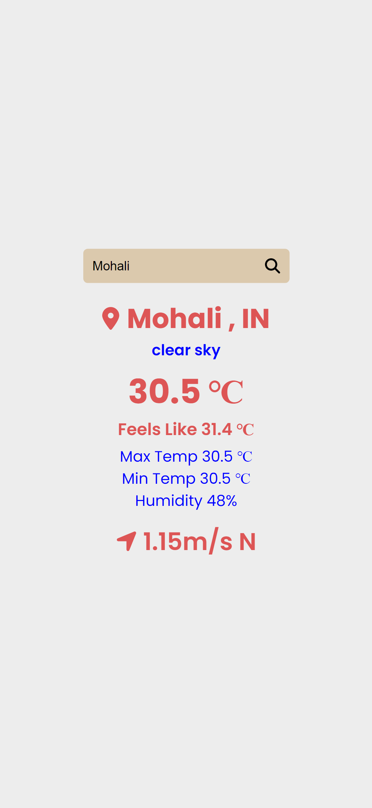
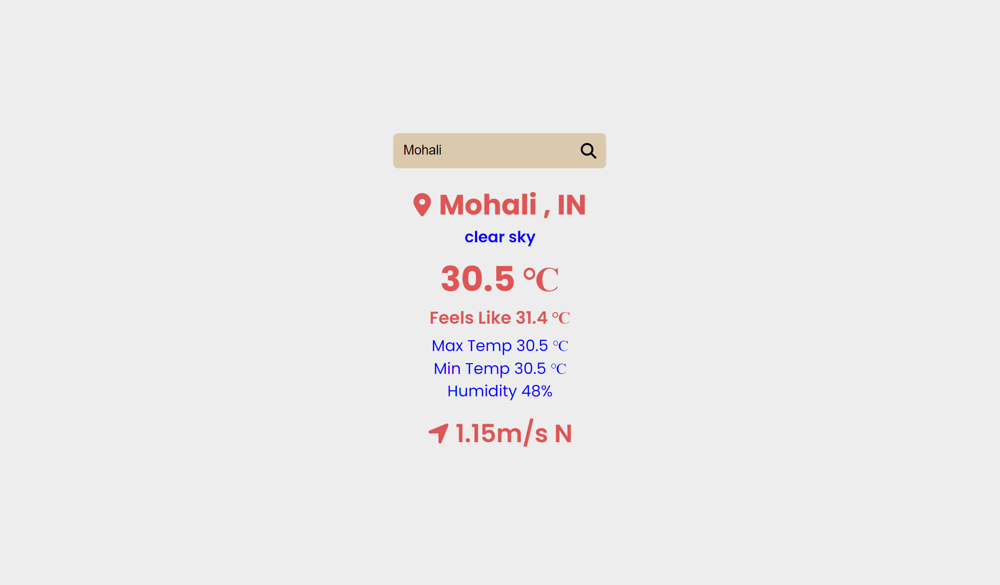

# Weather App

I Created this [Weather App](https://github.com/trigbitmohitjoshi/weatherapp) where you can get the information of weather of searched city.

- [Weather App](#weather-app)
    - [Links](#links)
    - [Screenshot](#screenshot)
    - [Built with](#built-with)
    - [Api Used](#api-used)
    - [Author](#author)

### Links

- Gthub Repo: [Weather App](https://github.com/trigbitmohitjoshi/weatherapp)
 

### Screenshot

### Built with

- ReactJs
- axios
- HTML5 & JSX
- CSS3 custom properties
- Fontawesome icons

### Api Used
 - [OpenWeather](https://openweathermap.org/)

### Author

- Github [@trigbitmohitjoshi](https://github.com/trigbitmohitjoshi)

